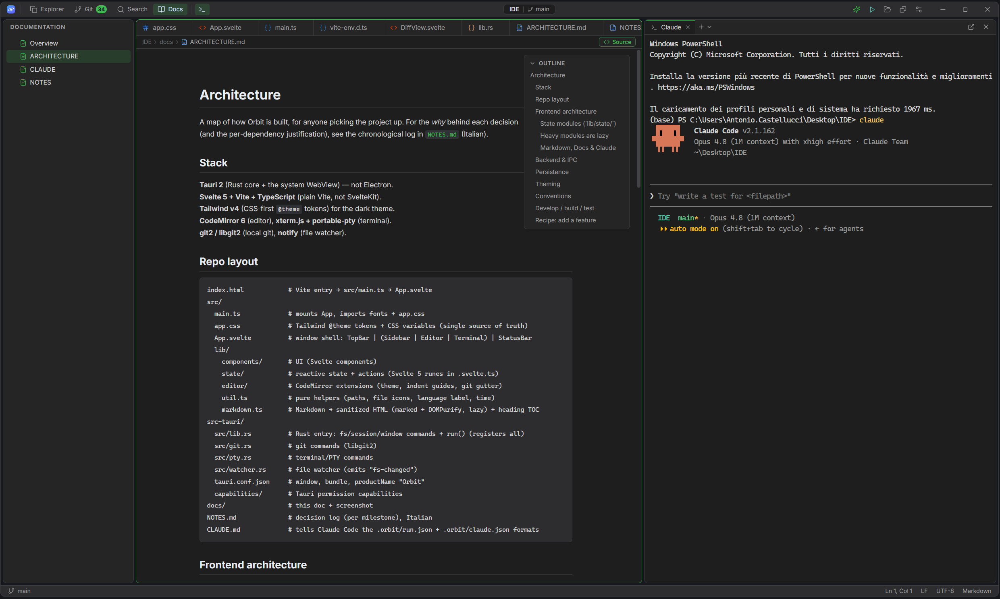

# Orbit

A **lightweight**, beautiful IDE built as a **companion for Claude Code**: edit code, browse
the project, manage git, and keep Claude Code running in an integrated terminal — all in a
cross-platform desktop app that weighs almost nothing.

> Orbit is **not** a heavy IDE (no LSP/debugger/refactoring) and **not** a chat GUI for Claude.
> It is the calm editor you keep next to Claude Code: it shows you everything, stays out of the
> way, and starts instantly.


---

## Why Orbit

- **It shows the whole project.** Unlike Visual Studio's "solution" view, Orbit lists the real
  filesystem — nothing is hidden. To keep that clean, you can put folders you don't care about
  on a **Shelf** (by category) instead of having them clutter the tree.
- **It closes the loop with Claude Code.** A one-click **Claude menu** opens `claude` in the
  project root and runs task **shortcuts** (update docs, gather context, commit & push with
  review); files Claude edits **reload by themselves**, changed files are **highlighted in the
  tree**, and terminal paths are **clickable**. Both **Run** and **Claude** configurations live in
  `.orbit/` and Claude itself can create them — the format is documented in your `CLAUDE.md`.
- **It is genuinely small.** A ~5 MB binary, ~220 MB RAM at rest (mostly the shared system
  WebView — Orbit's own Rust core is ~30 MB), and a ~170 KB startup payload.

### Project gates (non-negotiable)

1. **Extreme lightness** — minimal RAM, CPU and binary size. Every dependency must be justified.
2. **Curated dark mode** — at the level of IntelliJ / Visual Studio 2026.
3. **Real cross-platform** — Windows, macOS, Linux.

---

## Features

**Files & navigation**
- Virtualized, lazy file tree with type icons.
- File management from the context menu: new / rename / delete, **copy (relative) path**, **open a
  terminal here**, and **reveal in the OS file manager** (inline editing for new / rename).
- **Git decorations** in the tree: modified/added/deleted files are highlighted live (so you
  see exactly what changed — including what Claude just touched).
- **Shelf**: set aside uninteresting folders by category to declutter the tree without losing
  them — they sit at the bottom and stay browsable inline (`.orbit/shelf.json`).
- **Quick Open** (`Ctrl/Cmd+P`) with fuzzy ranking, and full‑text **project search**.

**Editor** (CodeMirror 6)
- Lazy, multi-language syntax highlighting (~140 grammars loaded on demand, plus a dedicated
  Svelte pack).
- Indentation guides, breadcrumb, find & replace (`Ctrl/Cmd+F`), smooth caret.
- **Go to symbol** (`Ctrl/Cmd+Shift+O`): fuzzy‑jump to functions, classes, methods and more in the
  active file (extracted from the editor's syntax tree).
- **Split view**: drag a tab to the edge to open files side by side (N panes); drag tabs between
  panes, or within a bar to reorder. A per-pane **"all tabs" menu** lists and closes tabs when many.
- **Word wrap** for long lines (the line-number gutter stays correct, VS Code-style).
- Auto-reload of open files changed on disk, with a conflict indicator for unsaved edits.
- Live status bar: line:column, language, end-of-line.

**Markdown & docs**
- Per-file **toggle** between source and a clean **reading-mode preview** (no split view) —
  `README` files open in preview by default.
- The preview adds a floating **outline (TOC)**, **interactive task lists** (ticking a box writes
  back to the source), and clickable internal links / heading anchors. Rendered HTML is sanitized.
- A dedicated **Docs** view organizes the project's Markdown (root `README` + everything under
  `docs/`) into a **hierarchical, collapsible tree** — ordered by numbered prefixes, with cleaned
  titles and archive folders tucked away — so even large documentation sets stay navigable.



**Terminal** (xterm.js + a real PTY, optional WebGL)
- Docked on the right, with **multiple tabs** and shell selection (PowerShell, cmd, Git Bash,
  WSL, bash/zsh…).
- **Clickable file paths** in the output (open the file at the line).
- **Pop out** the active terminal into an always-on-top **floating window** that carries the live
  session (`claude` keeps running), with the app's own title bar and chrome — and **dock** it back
  with one click.

**Git** (local, via libgit2)
- Status, diff, stage/unstage, commit, branch switch/create (from the status bar too), discard
  changes, and commit history with per-commit diffs.
- **Sync**: a local **ahead/behind** indicator (computed with libgit2, no network) plus one‑click
  **Fetch / Pull / Push / Merge** — these run the real `git` CLI in a terminal tab, so they reuse
  your existing git authentication and show real, supervised output.

**Run ▶ configurations**
- Define commands in `.orbit/run.json` and launch them in a terminal tab with one click. Use
  **"Set up for Claude"** to document the format in `CLAUDE.md`, so you can simply ask Claude to
  add a run configuration and it appears in the menu.

**Claude Code integration**
- A **Claude menu** opens `claude` in a terminal at the project root, plus one-click **shortcuts**
  (predefined prompts): update the docs, gather project context, or commit & push after reviewing
  what to keep vs discard. Shortcuts run **interactively**, so you stay in control.
- Configured in **`.orbit/claude.json`** (command, flags, shortcuts) — committed, and editable by
  Claude itself (the format is documented in `CLAUDE.md`), so you can just ask Claude to add one.
- Optionally, the **default terminal launches Claude** instead of a plain shell (toggle in Settings).
- A **Chats** view lists the project's recent Claude Code sessions (read from Claude's transcripts)
  and **resumes** one in a terminal with a click (`claude --resume`).

**Workspace**
- Session persistence per folder (reopens last folder, tabs and panel layout).
- **Multiple instances** ("New window") for working on several projects at once.
- **Settings**: editor/terminal font and size, accent color presets, smooth-caret toggle, and
  "launch Claude in the default terminal".

---

## Footprint

Measured on Windows (size-optimized release build):

| Item | Size |
|---|---|
| Portable `Orbit` binary | ~5 MB |
| MSI installer | ~3.7 MB |
| NSIS setup | ~2.5 MB |
| Frontend `dist/` | ~2.3 MB (most of it grammars loaded lazily) |
| Startup JS chunk | ~170 KB (≈57 KB gzipped) |
| RAM at rest (project open) | ~220 MB private working set (Orbit + WebView2; the Rust core is only ~30 MB — the rest is the shared system WebView, inherent to Tauri) |

The terminal's child processes are separate: a `claude` session (Node) or a shell add their own
memory on top, just as in any terminal. For comparison, an equivalent Electron app ships an
80–200 MB binary; VS Code uses 300–800 MB of RAM and IntelliJ 1–2 GB.

---

## Stack & key decisions

- **Tauri 2** (Rust + the system WebView), **not** Electron → no bundled Chromium, tiny binary.
- **Svelte 5 + Vite + TypeScript**, **not** SvelteKit → no router/SSR for a single-window app,
  smaller dependency tree, full control of the bundle.
- **Tailwind v4** (CSS-first `@theme` tokens) for the dark theme — a single source of truth.
- **CodeMirror 6**, **not** Monaco → far lighter; hand-written dark theme (VS Code Dark+ palette),
  grammars code-split and loaded on demand.
- **xterm.js + portable-pty** for a real cross-platform terminal (ConPTY on Windows).
- **git2 / libgit2** with default features off → local operations only (no openssl/libssh2).
- **notify** for the file watcher.
- **Lazy-loaded** CodeMirror and xterm so the first paint stays light.

For contributors, an architecture overview is in [docs/ARCHITECTURE.md](./docs/ARCHITECTURE.md).
The complete decision log (one entry per milestone, with the rationale for every dependency)
lives in [NOTES.md](./NOTES.md).

---

## Keyboard shortcuts

| Key | Action |
|---|---|
| `Ctrl/Cmd+P` | Quick open file by name |
| `Ctrl/Cmd+Shift+O` | Go to symbol in the active file |
| `Ctrl/Cmd+F` | Find / replace (within the focused editor) |
| `Ctrl/Cmd+S` | Save the active file |
| `Ctrl/Cmd+K` | Open folder |
| `Ctrl/Cmd+B` | Toggle sidebar |
| ``Ctrl/Cmd+` `` | Toggle terminal |

---

## Project configuration (`.orbit/`)

- `.orbit/run.json` — Run ▶ configurations (committed/shared). Format is documented to Claude in
  `CLAUDE.md` via "Set up for Claude".
- `.orbit/claude.json` — Claude launcher command/flags + task shortcuts (committed/shared). Format
  is documented to Claude in `CLAUDE.md` via the Claude menu's "Document shortcuts".
- `.orbit/shelf.json` — shelved folders by category (a personal view preference; git-ignored).

---

## Development

```bash
npm install
npm run tauri dev      # dev mode with hot reload
```

## Build

```bash
npm run tauri build    # binary + installers in src-tauri/target/release
```

## Test

```bash
npm run check                                    # Svelte/TS type-check (svelte-check)
cargo test --manifest-path src-tauri/Cargo.toml  # backend unit tests (filesystem / search)
```

## Requirements

- Node ≥ 20, Rust stable, and the Tauri prerequisites for your platform
  (see https://tauri.app/start/prerequisites/).
- **Windows**: WebView2 (preinstalled on Win11) + MSVC build tools.
- **Linux**: WebKitGTK 4.1 + libsoup3.
- **macOS**: Xcode command line tools.

> Built and verified end-to-end on Windows. The code is cross-platform by construction
> (Tauri 2 + standard crates; the few platform-specific bits are `cfg`-gated); a validation
> build on Linux/macOS is the remaining open item for gate #3.

## License

MIT
