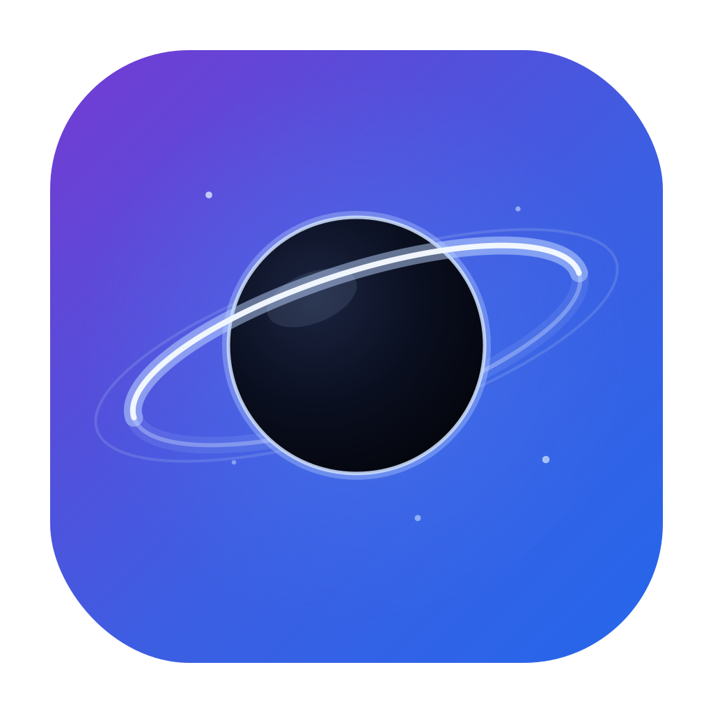

<div align="center">
  
  <br />
  
  <br /><br />
  <strong>A lightweight, beautiful IDE — companion for Claude&nbsp;Code</strong>
  <br /><br />
  
  
  
  
</div>

A **lightweight**, beautiful IDE built as a **companion for Claude Code**: edit code, browse
the project, manage git, and keep Claude Code running in an integrated terminal — all in a
cross-platform desktop app that weighs almost nothing.

> Orbit is **not** a heavy IDE (no LSP/debugger/refactoring) and **not** a chat GUI for Claude.
> It is the calm editor you keep next to Claude Code: it shows you everything, stays out of the
> way, and starts instantly.


---

## Why Orbit

- **It shows the whole project.** Unlike Visual Studio's "solution" view, Orbit lists the real
  filesystem — nothing is hidden. To keep that clean, you can put folders you don't care about
  on a **Shelf** (by category) instead of having them clutter the tree.
- **It closes the loop with Claude Code.** A one-click **Claude menu** opens `claude` in the
  project root and runs task **shortcuts** (update docs, gather context, commit & push with
  review); files Claude edits **reload by themselves**, changed files are **highlighted in the
  tree**, and terminal paths are **clickable**. Both **Run** and **Claude** configurations live in
  `.orbit/` and Claude itself can create them — the format is documented in your `CLAUDE.md`.
- **It is genuinely small.** A ~5 MB binary, ~220 MB RAM at rest (mostly the shared system
  WebView — Orbit's own Rust core is ~30 MB), and a ~492 KB startup chunk (≈168 KB gzipped).

### Project gates (non-negotiable)

1. **Extreme lightness** — minimal RAM, CPU and binary size. Every dependency must be justified.
2. **Curated dark mode** — at the level of IntelliJ / Visual Studio 2026.
3. **Real cross-platform** — Windows, macOS, Linux.

---

## Features

**Files & navigation**
- Virtualized, lazy file tree with **per-language type icons** — dedicated symbols for Rust, Svelte,
  Python, Go and Vue, monogram tiles for TS/JS/JSON/C/C++/C#/Java/…, line-art for everything else.
- File management from the context menu: new / rename / delete, **open to the side**, **open a
  terminal here**, **reveal in the OS file manager**, and copy path / relative path / name
  (inline editing for new / rename).
- **Git decorations** in the tree: modified/added/deleted files are highlighted live (so you
  see exactly what changed — including what Claude just touched).
- **Shelf**: set aside uninteresting folders by category to declutter the tree without losing
  them — they sit at the bottom and stay browsable inline (`.orbit/shelf.json`). A folder can be
  shelved on its own, or via a **by‑name rule** that hides *every* folder with that name — including
  nested ones and ones recreated later (e.g. all the `bin`/`obj` folders of a C# solution).
- **Follow active file**: an optional toggle (⌖ in the explorer toolbar) that auto‑expands the tree
  to the active file and reveals it as you switch tabs, Quick‑Open a file, or jump to a definition
  (VS Code's *reveal*).
- **Quick Open** (`Ctrl/Cmd+P`) with fuzzy ranking, and full‑text **project search**.
- **Drag in files**: drop files from your OS file manager onto the editor to open them.
- On Windows, after install Orbit appears in a file's **"Open with"** menu, so you can open it
  straight in Orbit.

**Editor** (CodeMirror 6)
- Lazy, multi-language syntax highlighting (~140 grammars loaded on demand, plus a dedicated
  Svelte pack).
- **Semantic highlighting overlay**: identifiers matching a known project **type** are colored teal
  and known **methods/functions** gold (VS-style), driven by the project symbol index — so even
  languages with only a lexical grammar (e.g. **C#**, **C/C++**) get type/method coloring for *your*
  code, without a language server. (Heuristic, by name; skips strings/comments.)
- **Autosave** (optional, on by default): saves edited files when the window loses focus and when you
  switch tabs (IntelliJ-style); it never overwrites a file changed on disk underneath you.
- Indentation guides, breadcrumb, find & replace (`Ctrl/Cmd+F`), smooth caret.
- **Go to symbol** (`Ctrl/Cmd+Shift+O`): fuzzy‑jump to functions, classes, methods and more in the
  active file (extracted from the editor's syntax tree).
- **Right‑click menu**: cut / copy / paste / select all / go to symbol.
- View **images and PDFs** inline (native viewer).
- **Split view**: drag a tab to the edge to open files side by side (N panes); drag tabs between
  panes, or within a bar to reorder. A per-pane **"all tabs" menu** lists and closes tabs when many.
- **Word wrap** for long lines (the line-number gutter stays correct, VS Code-style).
- Auto-reload of open files changed on disk, with a conflict indicator for unsaved edits; closing
  an unsaved file asks **Save / Don't save / Cancel**.
- Live status bar: line:column, language, end-of-line.

**Code navigation** (heuristic, no language server)
- A background **symbol index** of the whole project — classes, interfaces, structs, enums, methods,
  functions and more — for C#/Java, **C/C++**, TypeScript/JavaScript/Svelte, Python, Rust and Go. Built
  by a hand‑rolled Rust scanner (no LSP), cached under `.orbit/index/` and refreshed live as files change.
- **Go to definition** (`F12`, or `Ctrl/Cmd+click`) jumps across files; ambiguous names show a picker.
- **Project symbols** (`Ctrl/Cmd+T`): fuzzy‑jump to any symbol in the project.
- A **related bar** under the breadcrumb shows the symbol around the cursor (type › method) with its
  **base types / interfaces** and **implementers** (click to jump), plus kind badges (class,
  interface, abstract, method…).
- **Back / forward** navigation history — arrows in the top bar plus `Alt+←/→`. Browser-style: it
  records both code jumps (go-to-definition) **and** file/tab switches, so it returns to wherever you
  last were.

**Markdown & docs**
- Per-file **toggle** between source and a clean **reading-mode preview** (no split view). The
  default for `.md` files is a Setting — **Source**, **Preview**, or **READMEs only** (the default).
- The preview adds a floating **outline (TOC)**, **interactive task lists** (ticking a box writes
  back to the source), and clickable internal links / heading anchors. Rendered HTML is sanitized.
- A dedicated **Docs** view organizes the project's Markdown (root `README` + everything under
  `docs/`) into a **hierarchical, collapsible tree** — ordered by numbered prefixes, with cleaned
  titles and archive folders tucked away — so even large documentation sets stay navigable.


**Terminal** (xterm.js + a real PTY, optional WebGL)
- Docked on the right, with **multiple tabs** and shell selection (PowerShell, cmd, Git Bash,
  WSL, bash/zsh…).
- **Clickable file paths** in the output — open at the line; relative paths resolve against the
  terminal's folder or the project root.
- **Pop out** terminals into **floating windows** that carry the live session (`claude` keeps
  running) — detach **several** at once — with the app's own chrome: a **pin** toggles *always‑on‑top*
  on/off, a badge shows the project **folder + branch**, and you can **dock** any back with one click.

**Git** (local, via libgit2)
- Status, diff, stage/unstage, commit, branch switch/create (from the status bar too), discard
  changes, and commit history with per-commit diffs.
- **Sync**: a local **ahead/behind** indicator (computed with libgit2, no network) plus one‑click
  **Fetch / Pull / Push / Merge** — these run the real `git` CLI in a terminal tab, so they reuse
  your existing git authentication and show real, supervised output.

**Run ▶ configurations**
- Define commands in `.orbit/run.json` and launch them in a terminal tab with one click. Use
  **"Set up for Claude"** to document the format in `CLAUDE.md`, so you can simply ask Claude to
  add a run configuration and it appears in the menu.
- **Run a script file directly**: scripts (`.ps1`, `.cmd`/`.bat`, `.sh`) get a **Run ▶** action in
  the file tree's context menu and in the editor toolbar — launched in a terminal in the file's folder.

**Claude Code integration**
- A **Claude menu** (grouped into *Prompts*, *Wrappers* and *Configuration*) opens `claude` in a
  terminal at the project root, plus one-click **shortcuts** (predefined prompts): update the docs,
  gather project context, or commit & push after reviewing what to keep. Shortcuts run
  **interactively**, so you stay in control.
- **Prompt wrappers**: pick a wrapper (a template with a `{{input}}` placeholder), type your prompt,
  preview the composed text, and **copy it to the clipboard** to paste into Claude.
- **Add / remove** prompts and wrappers from a lightweight in-app panel (Claude menu → *Add / remove
  prompts…*) — it writes `.orbit/claude.json` for you and the menu reloads.
- Configured in **`.orbit/claude.json`** (command, flags, shortcuts) — committed, and editable by
  Claude itself (the format is documented in `CLAUDE.md`), so you can just ask Claude to add one. If
  that file ever has invalid JSON, Orbit keeps the current menu and warns instead of silently resetting.
- Optionally, the **default terminal launches Claude** instead of a plain shell (toggle in Settings).
- A **Chats** view lists the project's recent Claude Code sessions (read from Claude's transcripts) —
  each shown by its **latest message and turn count**, so they're easy to tell apart — and
  **resumes** one in a terminal with a click (`claude --resume`).
- A **Scratchpad** (📝 in the top bar) opens a persistent notes/prompts file (`.orbit/scratch.md`)
  to jot prompts and reuse them.
- **Attention when a terminal needs you** — when `claude` finishes a turn or waits for input (Orbit
  sets up Claude's `terminal_bell` for you), Orbit flags **which repo** (a dot on its tab) and **which
  tab**, keeps a `●` in the title and lights up the taskbar **while you're away**, and clears it when
  you open that terminal — so you can fire Claude off and look elsewhere (toggle in Settings).

**Workspace**
- Session persistence per folder (reopens last folder, tabs and panel layout).
- **Several folders in one window**: a row of **repository tabs** in the top bar keeps your projects
  one click apart. Switching the active repo swaps *everything* — tree, git, branch, search, Run/Claude
  menus, and the **terminal tabs** (each repo keeps its own live PTYs). Each repo also restores its own
  open editor tabs. Cycle with `Ctrl+Tab` / `Ctrl+Shift+Tab`, jump with `Ctrl+1…9`, and when the tabs
  don't all fit a **`…`** menu lists them; the top bar stays usable down to its minimum width. The
  repository list **and sessions are per‑window**: open windows don't share or overwrite each other's
  repo tabs, and the same folder can be open in two windows without their tabs/layout clobbering.
- **Remembers its window**: Orbit reopens at the same position, size and maximized state where you
  left it (restored to a connected monitor — never off-screen).
- **Multiple instances** ("New window") for working on several projects at once — each window's
  title shows its project, so the instances are easy to tell apart in the taskbar and Alt‑Tab.
- **Close all / reopen all windows**: with several windows open, **Close all** (top bar) closes every
  Orbit window at once, and the next launch **reopens them all at their previous positions**. Each
  window stays its own process; a tiny shared registry in the app config dir coordinates them (no extra
  runtime), and windows left by a crash are pruned so restore keeps working.
- **Color themes**: four full themes — **Orbit Dark** (default), **Eclipse** (OLED), **Slate** and
  **Orbit Light** — switched live; the accent can follow the theme (**Auto**) or use a preset.
- **Keyboard shortcut presets**: switch the keymap between **Orbit**, **Visual Studio** and
  **IntelliJ**, or build a **Custom** keymap from any preset by rebinding individual commands (with
  conflict warnings) — full reference in Settings → Keyboard shortcuts.
- **Settings**: theme, keymap preset (incl. Custom), editor/terminal font and size, accent color,
  smooth-caret toggle, **autosave**, **default Markdown view** (source / preview / READMEs only),
  terminal GPU rendering, "launch Claude in the default terminal", and "notify when a terminal needs you".

---

## Footprint

Measured on Windows (size-optimized release build):

| Item | Size |
|---|---|
| Portable `Orbit` binary | ~5.5 MB |
| MSI installer | ~4.0 MB |
| NSIS setup | ~2.7 MB |
| Frontend `dist/` | ~2.7 MB (most of it grammars loaded lazily) |
| Startup JS chunk | ~492 KB (≈168 KB gzipped) |
| RAM at rest (project open) | ~220 MB private working set (Orbit + WebView2; the Rust core is only ~30 MB — the rest is the shared system WebView, inherent to Tauri) |

The terminal's child processes are separate: a `claude` session (Node) or a shell add their own
memory on top, just as in any terminal. For comparison, an equivalent Electron app ships an
80–200 MB binary; VS Code uses 300–800 MB of RAM and IntelliJ 1–2 GB.

---

## Stack & key decisions

- **Tauri 2** (Rust + the system WebView), **not** Electron → no bundled Chromium, tiny binary.
- **Svelte 5 + Vite + TypeScript**, **not** SvelteKit → no router/SSR for a single-window app,
  smaller dependency tree, full control of the bundle.
- **Tailwind v4** (CSS-first `@theme` tokens) for the dark theme — a single source of truth.
- **CodeMirror 6**, **not** Monaco → far lighter; hand-written dark theme (VS Code Dark+ palette),
  grammars code-split and loaded on demand.
- **xterm.js + portable-pty** for a real cross-platform terminal (ConPTY on Windows).
- **git2 / libgit2** with default features off → local operations only (no openssl/libssh2).
- **notify** for the file watcher.
- **Lazy-loaded** CodeMirror and xterm so the first paint stays light.

For contributors, an architecture overview is in [docs/ARCHITECTURE.md](./docs/ARCHITECTURE.md).
The complete decision log (one entry per milestone, with the rationale for every dependency)
lives in [NOTES.md](./NOTES.md).

---

## Keyboard shortcuts

| Key | Action |
|---|---|
| `Ctrl/Cmd+P` | Quick open file by name |
| `Ctrl/Cmd+T` | Project symbols (across the whole project) |
| `Ctrl/Cmd+Shift+O` | Go to symbol in the active file |
| `F12` / `Ctrl/Cmd+click` | Go to definition |
| `Alt+←` / `Alt+→` | Navigate back / forward |
| `Ctrl+Tab` / `Ctrl+Shift+Tab` | Next / previous repository |
| `Ctrl/Cmd+1…9` | Switch to repository 1–9 |
| `Ctrl/Cmd+F` | Find / replace (within the focused editor) |
| `Ctrl/Cmd+S` | Save the active file |
| `Ctrl/Cmd+K` | Open folder |
| `Ctrl/Cmd+B` | Toggle sidebar |
| ``Ctrl/Cmd+` `` | Toggle terminal |

> These are the **Orbit** preset; switch to **Visual Studio** / **IntelliJ**, or make a **Custom**
> keymap by rebinding individual commands, in Settings → Keyboard shortcuts.

---

## Project configuration (`.orbit/`)

- `.orbit/run.json` — Run ▶ configurations (committed/shared). Format is documented to Claude in
  `CLAUDE.md` via "Set up for Claude".
- `.orbit/claude.json` — Claude launcher command/flags + task shortcuts + prompt wrappers
  (committed/shared). Format is documented to Claude in `CLAUDE.md` via the Claude menu's
  "Update CLAUDE.md for Claude".
- `.orbit/shelf.json` — shelved folders by category (a personal view preference; git-ignored).
- `.orbit/index/` — cached project symbol index for code navigation (rebuilt automatically; git-ignored).

---

## Development

```bash
npm install
npm run tauri dev      # dev mode with hot reload
```

## Build

```bash
npm run tauri build    # binary + installers in src-tauri/target/release
```

## Test

```bash
npm run check                                    # Svelte/TS type-check (svelte-check)
cargo test --manifest-path src-tauri/Cargo.toml  # backend unit tests (filesystem / search)
```

## Requirements

- Node ≥ 20, Rust stable, and the Tauri prerequisites for your platform
  (see https://tauri.app/start/prerequisites/).
- **Windows**: WebView2 (preinstalled on Win11) + MSVC build tools.
- **Linux**: WebKitGTK 4.1 + libsoup3.
- **macOS**: Xcode command line tools.

> Built and verified end-to-end on Windows. The code is cross-platform by construction
> (Tauri 2 + standard crates; the few platform-specific bits are `cfg`-gated); a validation
> build on Linux/macOS is the remaining open item for gate #3.

## License

MIT
