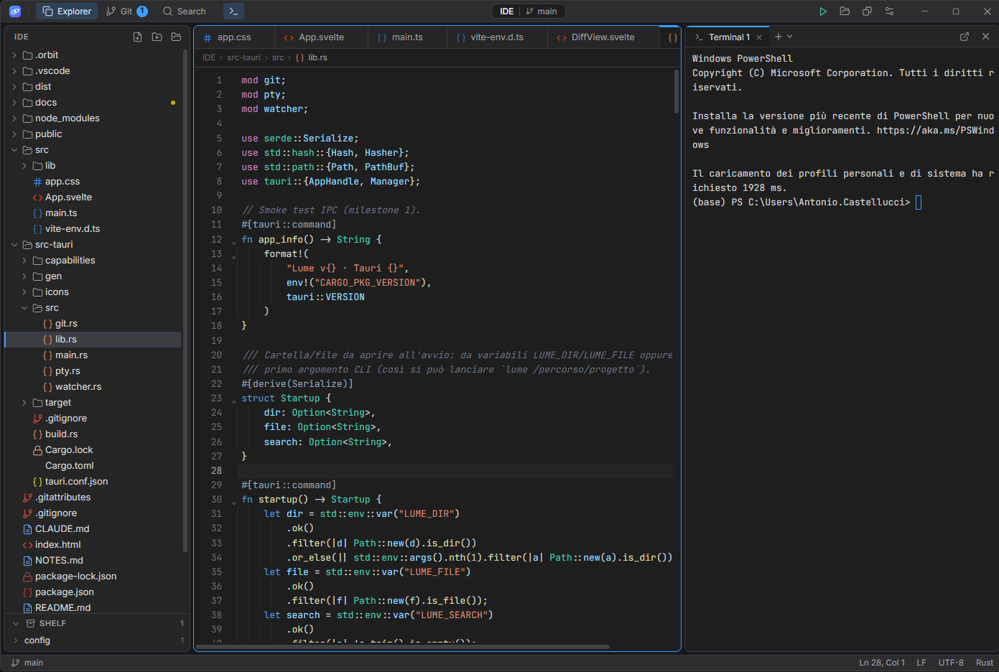

# Orbit

A **lightweight**, beautiful IDE built as a **companion for Claude Code**: edit code, browse
the project, manage git, and keep Claude Code running in an integrated terminal — all in a
cross-platform desktop app that weighs almost nothing.

> Orbit is **not** a heavy IDE (no LSP/debugger/refactoring) and **not** a chat GUI for Claude.
> It is the calm editor you keep next to Claude Code: it shows you everything, stays out of the
> way, and starts instantly.



---

## Why Orbit

- **It shows the whole project.** Unlike Visual Studio's "solution" view, Orbit lists the real
  filesystem — nothing is hidden. To keep that clean, you can put folders you don't care about
  on a **Shelf** (by category) instead of having them clutter the tree.
- **It closes the loop with Claude Code.** Files Claude edits in the terminal **reload by
  themselves**, changed files are **highlighted in the tree**, paths printed in the terminal are
  **clickable**, and you can define **Run configurations** that Claude itself can create —
  because Orbit documents the format in your `CLAUDE.md`.
- **It is genuinely small.** A ~5 MB binary, ~100 MB RAM at rest, and a 117 KB startup payload.

### Project gates (non-negotiable)

1. **Extreme lightness** — minimal RAM, CPU and binary size. Every dependency must be justified.
2. **Curated dark mode** — at the level of IntelliJ / Visual Studio 2026.
3. **Real cross-platform** — Windows, macOS, Linux.

---

## Features

**Files & navigation**
- Virtualized, lazy file tree with type icons.
- File management from the context menu: new / rename / delete / copy path (inline editing).
- **Git decorations** in the tree: modified/added/deleted files are highlighted live (so you
  see exactly what changed — including what Claude just touched).
- **Shelf**: set aside uninteresting folders by category to declutter the tree without losing
  them — they sit at the bottom and stay browsable inline (`.orbit/shelf.json`).
- **Quick Open** (`Ctrl/Cmd+P`) with fuzzy ranking, and full‑text **project search**.

**Editor** (CodeMirror 6)
- Lazy, multi-language syntax highlighting (~140 grammars loaded on demand).
- Indentation guides, breadcrumb, find & replace (`Ctrl/Cmd+F`), smooth caret.
- Auto-reload of open files changed on disk, with a conflict indicator for unsaved edits.
- Live status bar: line:column, language, end-of-line.

**Terminal** (xterm.js + a real PTY, WebGL renderer)
- Docked on the right, with **multiple tabs** and shell selection (PowerShell, cmd, Git Bash,
  WSL, bash/zsh…).
- **Clickable file paths** in the output (open the file at the line).
- An always-on-top **floating terminal window** — keep `claude` running while you work.

**Git** (local, via libgit2)
- Status, diff, stage/unstage, commit, branch switch/create (from the status bar too), discard
  changes, and commit history with per-commit diffs.

**Run ▶ configurations**
- Define commands in `.orbit/run.json` and launch them in a terminal tab with one click. Use
  **"Set up for Claude"** to document the format in `CLAUDE.md`, so you can simply ask Claude to
  add a run configuration and it appears in the menu.

**Workspace**
- Session persistence per folder (reopens last folder, tabs and panel layout).
- **Multiple instances** ("New window") for working on several projects at once.
- **Settings**: editor/terminal font and size, accent color presets, smooth-caret toggle.

---

## Footprint

Measured on Windows (size-optimized release build):

| Item | Size |
|---|---|
| Portable `Orbit` binary | ~5 MB |
| MSI installer | ~3.7 MB |
| NSIS setup | ~2.5 MB |
| Frontend `dist/` | ~2.3 MB (most of it grammars loaded lazily) |
| Startup JS chunk | ~117 KB (≈40 KB gzipped) |
| RAM at rest | ~100 MB (dominated by the system WebView, inherent to Tauri) |

For comparison, an equivalent Electron app ships an 80–200 MB binary; VS Code uses 300–800 MB
of RAM and IntelliJ 1–2 GB.

---

## Stack & key decisions

- **Tauri 2** (Rust + the system WebView), **not** Electron → no bundled Chromium, tiny binary.
- **Svelte 5 + Vite + TypeScript**, **not** SvelteKit → no router/SSR for a single-window app,
  smaller dependency tree, full control of the bundle.
- **Tailwind v4** (CSS-first `@theme` tokens) for the dark theme — a single source of truth.
- **CodeMirror 6**, **not** Monaco → far lighter; hand-written dark theme (VS Code Dark+ palette),
  grammars code-split and loaded on demand.
- **xterm.js + portable-pty** for a real cross-platform terminal (ConPTY on Windows).
- **git2 / libgit2** with default features off → local operations only (no openssl/libssh2).
- **notify** for the file watcher.
- **Lazy-loaded** CodeMirror and xterm so the first paint stays light.

The complete decision log (one entry per milestone, with the rationale for every dependency)
lives in [NOTES.md](./NOTES.md).

---

## Keyboard shortcuts

| Key | Action |
|---|---|
| `Ctrl/Cmd+P` | Quick open file by name |
| `Ctrl/Cmd+F` | Find / replace in the file |
| `Ctrl/Cmd+S` | Save the active file |
| `Ctrl/Cmd+K` | Open folder |
| `Ctrl/Cmd+B` | Toggle sidebar |
| ``Ctrl/Cmd+` `` | Toggle terminal |

---

## Project configuration (`.orbit/`)

- `.orbit/run.json` — Run ▶ configurations (committed/shared). Format is documented to Claude in
  `CLAUDE.md` via "Set up for Claude".
- `.orbit/shelf.json` — shelved folders by category (a personal view preference; git-ignored).

---

## Development

```bash
npm install
npm run tauri dev      # dev mode with hot reload
```

## Build

```bash
npm run tauri build    # binary + installers in src-tauri/target/release
```

## Test

```bash
npm run check                                    # Svelte/TS type-check (svelte-check)
cargo test --manifest-path src-tauri/Cargo.toml  # backend unit tests (filesystem / search)
```

## Requirements

- Node ≥ 20, Rust stable, and the Tauri prerequisites for your platform
  (see https://tauri.app/start/prerequisites/).
- **Windows**: WebView2 (preinstalled on Win11) + MSVC build tools.
- **Linux**: WebKitGTK 4.1 + libsoup3.
- **macOS**: Xcode command line tools.

> Built and verified end-to-end on Windows. The code is cross-platform by construction
> (Tauri 2 + standard crates; the few platform-specific bits are `cfg`-gated); a validation
> build on Linux/macOS is the remaining open item for gate #3.

## License

MIT
